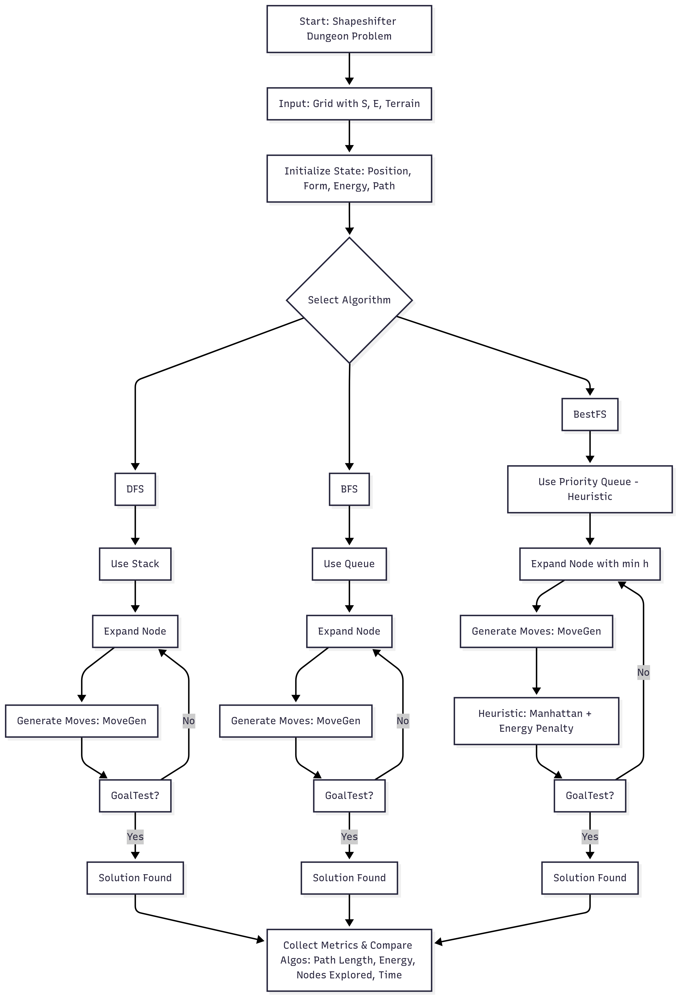

# Search Algorithms for the Shapeshifter Mage Problem

**Authors:** U20230101, U20230107 , U20230071  
**Date:** Today

## Introduction

This project implements and compares three search algorithms—**Depth-First Search (DFS)**, **Breadth-First Search (BFS)**, and **Best-First Search (BestFS)**—for solving the Shapeshifter Dungeon Problem. In this pathfinding challenge, a shapeshifting character must navigate from a start cell (S) to an exit cell (E) in a 2D grid dungeon. The character can transform between three forms: Human (for land), Fish (for water), and Bird (for pits). Each movement costs 1 energy unit, transformations cost 2 additional units, and the character must reach the exit with positive energy remaining. The algorithms are evaluated based on nodes explored, path length, energy consumption, and execution time.

<div style="page-break-after: always;"></div>



## Implementation Structure

The project is organized into modular files:

- **shapeshifter.h**: Defines core data structures including `State` (position, form, energy, path) and `Dungeon` (grid, dimensions, start/exit positions). Declares function prototypes for movement generation, goal testing, and heuristic calculation.

- **shapeshifter.cpp**: Implements utility functions:
  - `isValid()`: Validates grid coordinates
  - `canMove()`: Checks if a cell is traversable
  - `requiredForm()`: Determines the form needed for a terrain type
  - `MoveGen()`: Generates valid successor states considering energy costs and transformations
  - `GoalTest()`: Verifies if the exit is reached with positive energy
  - `heuristic()`: Calculates Manhattan distance plus energy penalty for BestFS

- **dfs.cpp**: Implements DFS using a stack data structure, exploring depth-first until the goal is found or all paths are exhausted.

- **bfs.cpp**: Implements BFS using a queue data structure, exploring breadth-first to guarantee shortest path in terms of steps.

- **bestfs.cpp**: Implements Best-First Search using a priority queue ordered by heuristic values, attempting to minimize energy usage while reaching the goal efficiently.

- **main.cpp**: Orchestrates the testing framework, runs all three algorithms on predefined test cases, and generates comprehensive performance metrics and comparison tables.

## Time Complexity Analysis

The complexity analysis considers the contribution of each function to the overall algorithm performance:

### DFS (Depth-First Search)
- **Main loop**: O(V) where V is the number of reachable states
- **MoveGen()**: O(1) per call (examines 4 directions)
- **GoalTest()**: O(1) per call
- **Overall**: O(b^m) where b is branching factor (≤4) and m is maximum depth
- **Space**: O(bm) for the stack and closed set

### BFS (Breadth-First Search)  
- **Main loop**: O(V) where V is the number of reachable states
- **MoveGen()**: O(1) per call (examines 4 directions)
- **GoalTest()**: O(1) per call
- **Overall**: O(b^d) where d is depth of shallowest goal
- **Space**: O(b^d) for the queue and closed set

### BestFS (Best-First Search)
- **Main loop**: O(V log V) due to priority queue operations
- **MoveGen()**: O(1) per call (examines 4 directions)  
- **GoalTest()**: O(1) per call
- **heuristic()**: O(1) per call (Manhattan distance calculation)
- **Overall**: O(b^d log(b^d)) in worst case, but typically much better due to heuristic guidance
- **Space**: O(b^d) for the priority queue and closed set

## Test Cases and Results

### Test Case 1: 3x3 Grid
**Input Grid:**
```
SLW
WLL  
ELL
```

**Algorithm Results:**
- **DFS Path**: (0,0,HUMAN,115) → (0,1,HUMAN,114) → (0,2,FISH,111) → (1,2,HUMAN,108) → (1,1,HUMAN,107) → (1,0,FISH,104) → (2,0,HUMAN,101)
  - Path Length: 7, Energy Consumed: 14, Nodes Explored: 7
- **BFS Path**: (0,0,HUMAN,115) → (1,0,FISH,112) → (2,0,HUMAN,109)
  - Path Length: 3, Energy Consumed: 6, Nodes Explored: 4
- **BestFS Path**: (0,0,HUMAN,115) → (0,1,HUMAN,114) → (1,1,HUMAN,113) → (2,1,HUMAN,112) → (2,0,HUMAN,111)
  - Path Length: 5, Energy Consumed: 4, Nodes Explored: 9

### Test Case 2: 6x6 Grid
**Input Grid:**
```
SLLWLL
LPWPWL
LWLWPL
LLLPLL
WWLLPL
LLLLEL
```

**Algorithm Results:**
- **DFS Path**: 32-step path with multiple transformations
  - Path Length: 32, Energy Consumed: 67, Nodes Explored: 32
- **BFS Path**: (0,0,HUMAN,115) → (1,0,HUMAN,114) → ... → (5,4,HUMAN,102)
  - Path Length: 10, Energy Consumed: 13, Nodes Explored: 34
- **BestFS Path**: (0,0,HUMAN,115) → (1,0,HUMAN,114) → ... → (5,4,HUMAN,106)
  - Path Length: 10, Energy Consumed: 9, Nodes Explored: 36

## Performance Metrics

**Nodes Explored**: Measures computational efficiency by counting states examined. Lower values indicate more focused search strategies.

**Path Length**: Number of steps in the solution path. BFS guarantees minimum path length, while DFS and BestFS may produce longer paths.

**Energy Consumed**: Total energy spent on movement and transformations. Reflects the quality of the solution in terms of resource management.

**Execution Time**: Runtime in milliseconds. Critical for real-time applications, though all algorithms perform well on small grids.

## Overall Performance Comparison

| Algorithm | Success Rate | Avg Nodes Explored | Avg Path Length | Avg Energy Consumed | Avg Time (ms) |
|-----------|--------------|-------------------|-----------------|-------------------|---------------|
| DFS       | 100.0%       | 12.6              | 12.6            | 24.7              | 0.548         |
| BFS       | 100.0%       | 14.7              | 6.0             | 7.6               | 0.135         |
| BestFS    | 100.0%       | 16.6              | 6.6             | 6.1               | 0.453         |

## Discussion and Conclusions

**DFS** demonstrates space efficiency but produces suboptimal paths due to its depth-first exploration strategy, leading to higher energy consumption and longer paths. It's suitable when memory is severely constrained.

**BFS** consistently delivers optimal solutions in terms of path length and maintains reasonable energy consumption. However, it requires significantly more memory to store the frontier, making it less suitable for very large problem instances.

**BestFS** strikes a balance between efficiency and performance, using the Manhattan distance heuristic to guide search toward the goal. While it doesn't guarantee optimal paths, it achieves the best energy efficiency and reasonable path lengths with moderate computational overhead.

The results suggest that BFS is ideal when optimality is paramount and memory is available, while BestFS offers the best practical performance for energy-constrained scenarios. DFS, despite its simplicity, is generally unsuitable for this type of pathfinding problem due to poor solution quality.

Future improvements could include implementing A* search to combine BFS optimality guarantees with BestFS heuristic efficiency, or developing energy-aware heuristics that better capture the transformation costs in the shapeshifter domain.